# BH_PCMLAI_CAPSTONE

## Capstone Project for Berkeley Haas - Professional Certificate in Machine Learning and Artificial Intelligence

### Notebooks
https://github.com/stormrryder/BH_PCMLAI_CAPSTONE/blob/main/capstone.ipynb
https://github.com/stormrryder/BH_PCMLAI_CAPSTONE/blob/main/capstoneNN.ipynb

### Foreword
- This project is designed to analyze proprietary data.
- Given the nature of the data, it is not included in this repository.
- Instead a very small synthetic dataset is included.
- The dataset allows to execute the notebook but will not generate any significant results.

### Background
- Jira is used to track smaller parts of a larger project.
- The Jira issue type used is called a "Work Package".
- Ideally it is similar in size to what is recommended by Agile best practices but at times it can be larger.
- The Work Package workflow is depicted in the figure below.
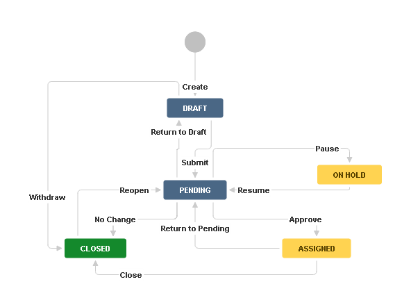
- When a work package information is complete, mainly the scope of the change, it is submitted to a Change Control Board (CCB).
- The work package is moved to the Pending state.
- The board reviews the information and confirms that the change is necessary and can be accomplished within the schedule and budget constraints.
- Once confirmation is completed, the work package is moved by the board to the Assigned state.
- While in the Assigned state, the engineering team implements the approved change and moves the work package to Closed state when done.

### Problem Statement
- When implementing changes, the team may discover that the effort to complete the work package is higher than estimated by the board.
- In those cases, the team will move the work package back to the Pending state with additional information for a second approval.
- This backward movement disrupt the workflow and adds delays.

### Supporting Data
- Jira has a REST API which allows to download all the fields of the issues.
- It also allows to download the history of the issues which is needed to see the state transitions.
- Initial investigation of this data indicates that backward transitions happened for about 12% of the work packages of a specific project.
- It also revealed that 40 some work packages were moved backward more than once, up to 5 times.

### Objective
1. The primary goal is to detect whether the work package is likely to move backward. This could be used by an engineer submitting a new issue or by the board when reviewing an entry.
2. The secondary goal is to indicate the likely cause of the backward movement.
3. A tertiary goal is to build a model that can be reused by different project. It is suspected that different team working on different products have different reasons for backward movement. But all these projects use the same Jira issue type, with a common structure. The generic model likely must be trained for each project.

### Exploratory Data Analysis

TARGET:
- We can confirm that the classification task is for an unbalanced dataset.
- The label of interest is found in about 13% of the issues.
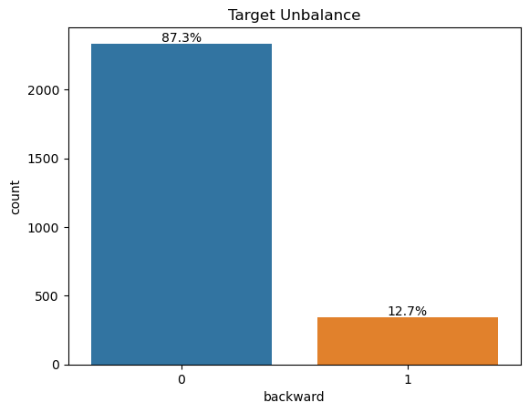

CORRELATION:
- Backward has very low correlation with any features.
- Only 7 features have correlation over 0.10 with the target.
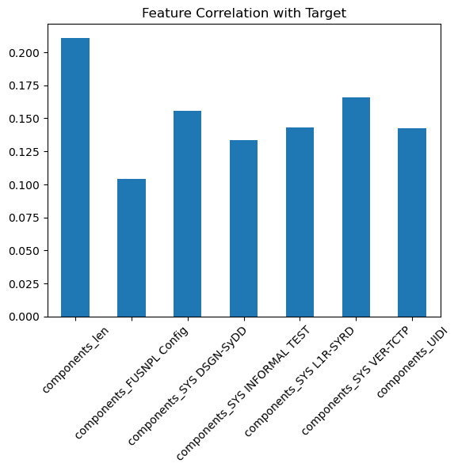

DATA TYPE: TEXT LENGTH</h4>
- The distribution of text length is similar wether the issue went backwards or not.
- However, as the length increased, the changes of going backward seems to slightly increase.
- There are outliers with great text lengths, those should be removed.
- Number of sentences for the summary text field does not make sense as it is a one-liner field. This feature should be discarded.
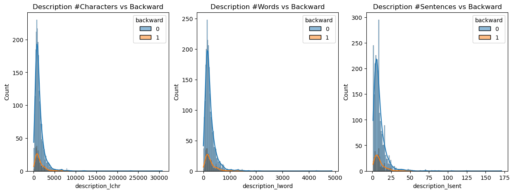
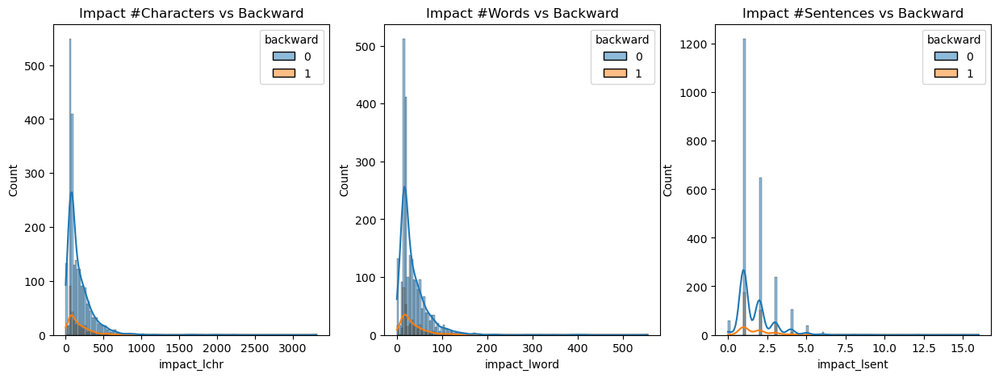
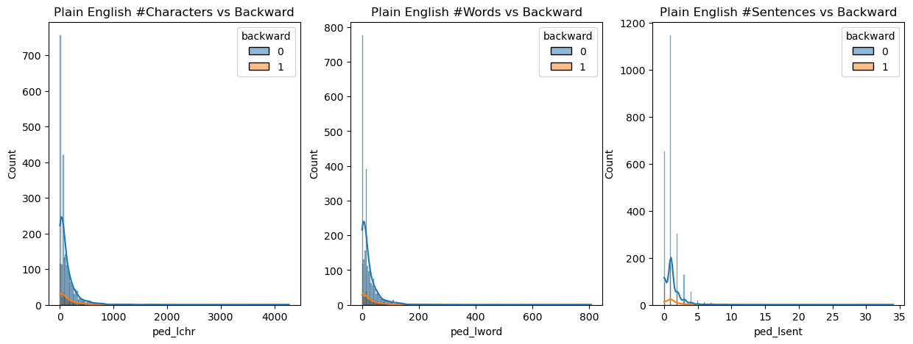
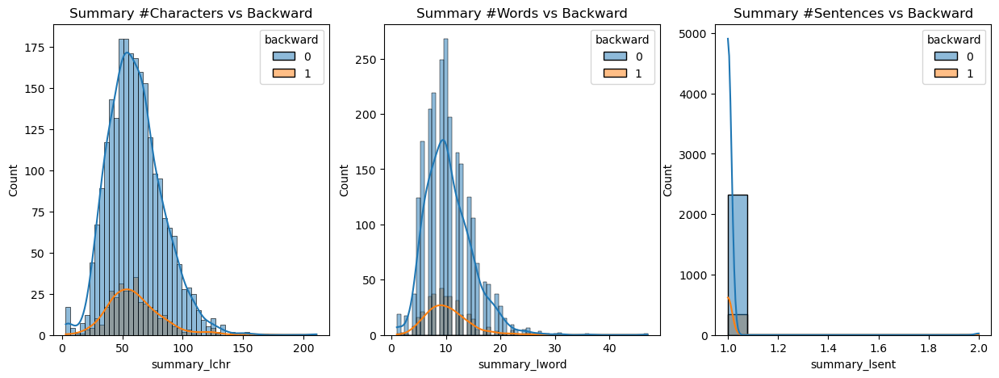

DATA TYPE: LISTS</h4>
- Issues going backward tends to affect more components.
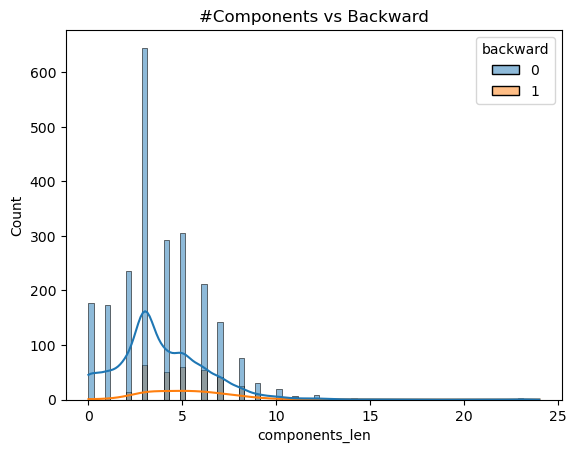

DATA TYPE: CATEGORIES
- 'Enhancement' and 'Program Planned' are more likely to go backward.
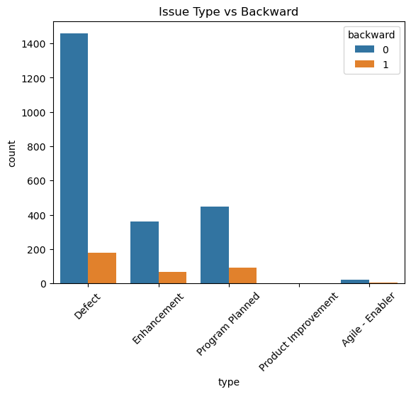

DATA TYPE: WORDS
- Looking a the top 20 ranked words, we can see a few words that are more frequent within issues that go backward: control, need, ca, new, feature, mode, entry, see, field.
- Some of these words are related to previously observations. New features are more likely to go backward.
- By comparing the words frequency ranking, we can see which words have a strong likelyhood to belong to each category. For example, the words 'src', 'performance' and 'tag' are more likely to show up in issues going backwards. While words 'pba', 'inbd', 'hfom' are more common in issues NOT going backwards.
- Lastly, there are words that show up only in issues that went backwards and other words that only show up in issues NOT going backward.
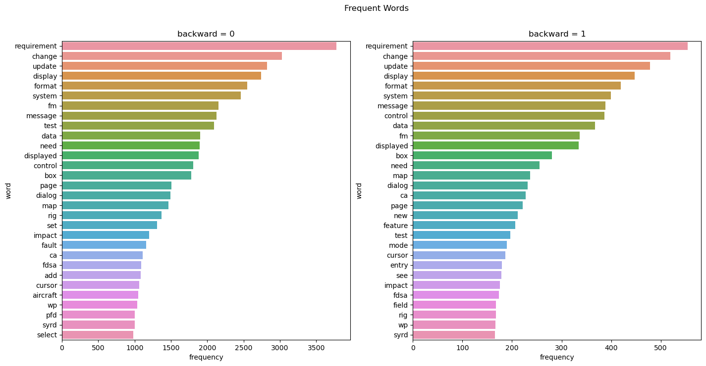
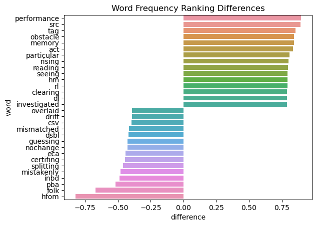

 backward = 1                         |   backward = 0
:------------------------------------:|:-------------------------:
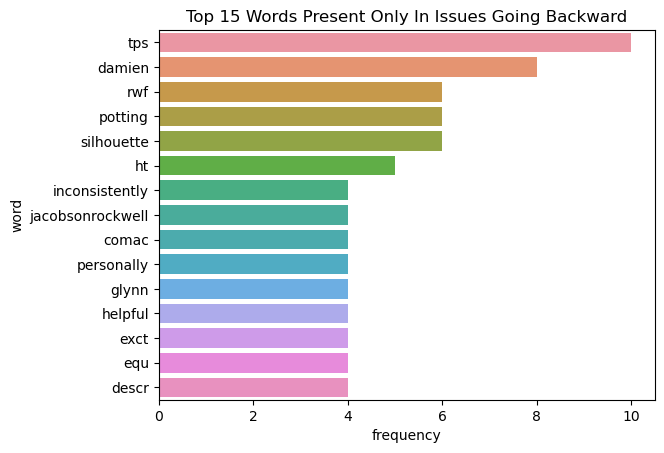  |  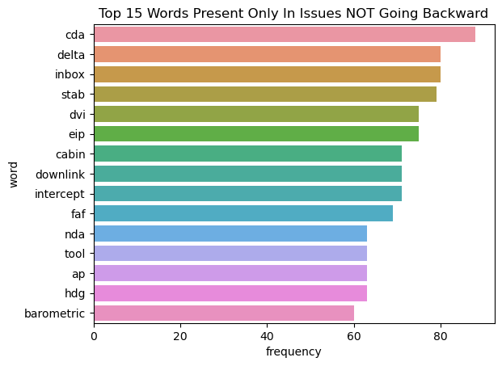

### Modeling Approach
- The data will be separated into 3 sets: Training 80%, Validation 10% and Testing 10%.
- We will use two cross validation methods: train/validation split and Repeated KFolds
- We will use F1-Score as the metric to evaluate against. We want a balance of finding most issues while being precise.
- When dealing with text, we will use 5 methods: Bags of Words, Word level TF-IDF, N-gram Level TF-IDF, Character Level TF-IDF  and token embeddings.
- We will evaluate using these basic models: Logistic Regression, Naive Bayes, Nearest Neighbors, Decision Tree, Support Vector Machine, Random Forest (Bagging Ensemble), XGBoost (Boosting Ensemble)
- We will also use Neural Networks with flat inputs, 2D embeddings into a CNN, 2D embeddings into a RNN.

### Results
- Unfortunately, all of the legacy models could not acheive more than 30%. Many of these models are overfitting and none of the regularization inputs helped to resolve the issue.
- This was true with both cross-validation methods.
- The neural networks did not overfit but the training score were in the same range below 30%. The performance did not increase when the model architecture complexity increased. Adjusting the optimizer type, learning rate and batch size also did not change the results. This suggest that either the architectures are incorrect or the data does not contain the necessary information for proper classification.
- Although not included in the provided notebooks, under-sampling and over-sampling methods were used to balance the dataset. These methods did not help either.
- Also not included was the attempt to create our own token embeddings using keras embedding layer. This created severe overfitting that could not be overcome.
- Lastly, the source data was augmented from a single jira project to four. This did not help either.

### Next Steps
- Even though I have tried several pre-trained text classification models: SBERT (2 models) and tensor hub (4 models), I would like to try with one from Hugging Face.
- There are a few experts in AI/ML at my workplace, it is time to socialize with them and see if they could suggest a different solution or a mistake in my approaches.